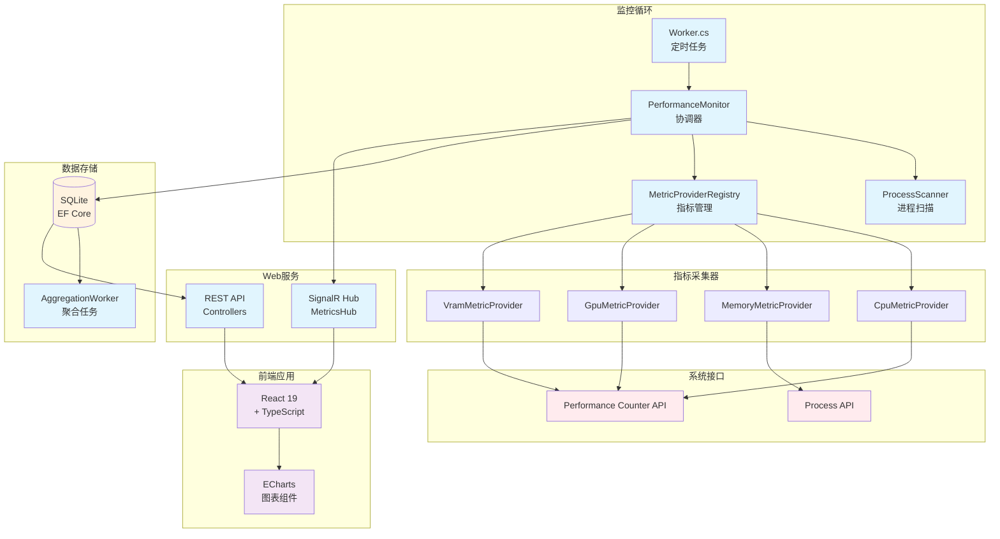
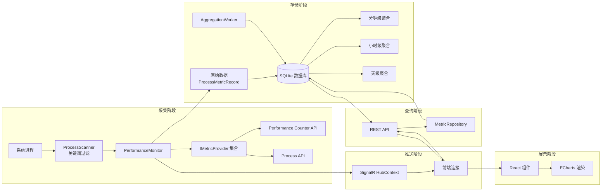

# 架构设计

## 概述

XhMonitor 是一个高性能的 Windows 进程资源监控系统，用于实时采集、聚合分析和可视化进程的 CPU、内存、GPU、显存等资源使用情况。它使系统管理员和开发人员能够深入了解 Windows 系统中各个进程的资源消耗模式。系统采用分层架构设计，后端基于 .NET 8 实现数据采集和聚合，前端使用 React + TypeScript 提供现代化的可视化界面，并通过 SignalR 实现实时数据推送。系统支持配置驱动的指标扩展，无需修改前端代码即可添加新的监控指标。

## 技术栈

**语言与运行时**
- C# 12 (.NET 8)
- TypeScript 5.9

**框架**
- ASP.NET Core Web API (后端)
- React 19 + Vite 7 (前端)

**数据存储**
- SQLite (EF Core 8)
- 分层聚合存储（原始数据、分钟级、小时级、天级）

**基础设施**
- 本地 Windows 服务部署
- Kestrel Web 服务器

**外部服务**
- Windows Performance Counter API
- System.Diagnostics.Process API

**实时通信**
- SignalR (@microsoft/signalr)

**前端 UI**
- TailwindCSS v4 (Glassmorphism 设计)
- ECharts 6 (数据可视化)
- Lucide React (图标库)

**日志**
- Serilog (文件日志)

## 项目结构

```
project-root/
├── XhMonitor.Core/          # 核心库，定义接口和实体
│   ├── Entities/          # 数据实体
│   ├── Enums/             # 枚举类型
│   ├── Interfaces/        # 核心接口
│   ├── Models/            # 数据模型
│   ├── Providers/         # 指标采集器
│   └── Interop/           # 系统互操作
├── XhMonitor.Service/      # 后端服务
│   ├── Controllers/       # REST API 控制器
│   ├── Hubs/             # SignalR Hub
│   ├── Core/             # 核心业务逻辑
│   ├── Data/             # 数据访问层
│   ├── Models/           # 服务模型
│   ├── Workers/          # 后台任务
│   └── Migrations/       # EF Core 迁移
├── xhmonitor-web/         # 前端 Web 应用
│   ├── src/
│   │   ├── components/  # React 组件
│   │   ├── hooks/       # 自定义 Hooks
│   │   └── types.ts     # TypeScript 类型定义
├── SqliteTest/            # 测试项目
└── .mcai/docs/           # 项目文档
```

**入口点**
- `XhMonitor.Service/Program.cs` - 服务启动和依赖注入配置
- `xhmonitor-web/src/main.tsx` - React 应用入口
- `XhMonitor.Service/Worker.cs` - 主监控循环入口

## 子系统

### PerformanceMonitor (性能监控核心)
**目的**: 协调进程扫描和指标采集的核心引擎
**位置**: `XhMonitor.Service/Core/PerformanceMonitor.cs`
**关键文件**: `ProcessScanner.cs`, `MetricProviderRegistry.cs`
**依赖**: ProcessScanner, MetricProviderRegistry, 各种 IMetricProvider
**被依赖**: Worker (主监控循环)

### MetricProviderRegistry (指标提供者注册表)
**目的**: 管理所有指标采集器，支持插件化扩展
**位置**: `XhMonitor.Service/Core/MetricProviderRegistry.cs`
**关键文件**: `XhMonitor.Core/Providers/` (CpuMetricProvider, MemoryMetricProvider, GpuMetricProvider, VramMetricProvider)
**依赖**: IMetricProvider 接口, XhMonitor.Core.Providers
**被依赖**: PerformanceMonitor, ConfigController

### AggregationWorker (数据聚合后台任务)
**目的**: 定时将原始数据聚合为分钟级、小时级、天级统计数据
**位置**: `XhMonitor.Service/Workers/AggregationWorker.cs`
**依赖**: MonitorDbContext, IProcessMetricRepository
**被依赖**: 后台服务宿主

### SignalR Hub (实时通信)
**目的**: 通过 WebSocket 实时推送最新指标数据到前端
**位置**: `XhMonitor.Service/Hubs/MetricsHub.cs`
**依赖**: PerformanceMonitor, IMetricProvider
**被依赖**: 前端 @microsoft/signalr 客户端

### REST API (查询接口)
**目的**: 提供历史数据查询和配置管理接口
**位置**: `XhMonitor.Service/Controllers/`
**依赖**: IProcessMetricRepository, MetricProviderRegistry
**被依赖**: 前端 HTTP 客户端

### React 前端 (可视化界面)
**目的**: 提供现代化的数据可视化界面，展示实时和历史指标
**位置**: `xhmonitor-web/src/`
**关键文件**: `App.tsx`, `ProcessList.tsx`, `MetricChart.tsx`, `SystemSummary.tsx`
**依赖**: SignalR, REST API, ECharts
**被依赖**: 用户浏览器

## 关键流程

### 指标采集主循环

**触发**: 定时器（默认 5 秒间隔）
**路径**: Worker → PerformanceMonitor → ProcessScanner → IMetricProvider → Database
**结果**: 所有监控进程的最新指标被采集并存储到数据库

1. Worker 定时触发 PerformanceMonitor.CollectAllAsync()
2. ProcessScanner 扫描系统进程，根据关键词过滤
3. PerformanceMonitor 为每个进程调用所有注册的 IMetricProvider
4. 指标数据通过 SignalR 实时推送到前端
5. 原始数据通过 IProcessMetricRepository 持久化到 SQLite
6. AggregationWorker 后台任务定期聚合数据

### 数据查询流程

**触发**: 用户在 Web 界面加载数据
**路径**: React 组件 → REST API → IProcessMetricRepository → Database
**结果**: 返回请求的历史指标数据

1. React 组件调用 REST API 端点
2. MetricsController 处理请求
3. MetricRepository 查询数据库（支持分页和过滤）
4. 结果以 JSON 格式返回给前端
5. ECharts 渲染图表展示数据

### 实时推送流程

**触发**: 新的指标数据被采集
**路径**: PerformanceMonitor → MetricsHub → SignalR → React Hook → UI 更新
**结果**: 前端实时显示最新指标

1. PerformanceMonitor 完成数据采集
2. 通过 IHubContext<MetricsHub> 广播消息
3. SignalR 将消息推送到所有连接的客户端
4. React 的 useMetricsHub Hook 接收消息
5. 组件状态更新，UI 自动刷新


## 系统架构图



## 数据流图




## 设计决策

### 1. 为什么使用 SQLite？

**决策**: 使用 SQLite 而非 MySQL/PostgreSQL

**理由**:
- 部署简单，无需独立数据库服务
- 适合本地部署场景
- 文件数据库，易于备份和迁移
- 性能满足监控数据存储需求

**权衡**: 不适合高并发写入，但监控场景写入频率可控（5秒间隔）

### 2. 为什么使用 Performance Counter 而非 WMI？

**决策**: 使用 Windows Performance Counter API

**理由**:
- 性能更高，延迟更低
- 官方推荐用于性能监控
- 精确的实时数据

**权衡**:
- 部分指标需要实例名映射（如 PID → InstanceName）
- 需要两次调用才能获取准确值
- 计划未来替换为 WMI 异步 API

### 3. 为什么分层聚合存储？

**决策**: 存储分钟级、小时级、天级聚合数据

**理由**:
- 加速历史数据查询
- 减少数据量，提高性能
- 支持不同时间粒度的分析

**实现**:
- 存储累加值（Sum）和计数（Count），支持加权平均
- 使用 AggregationWorker 后台任务自动聚合

### 4. 为什么使用插件化指标系统？

**决策**: 通过 IMetricProvider 接口实现可插拔的指标系统

**理由**:
- 支持扩展自定义指标而无需修改核心代码
- 前端自动发现新指标，无需 UI 修改
- 便于第三方贡献者开发指标插件

**实现**:
- MetricProviderRegistry 动态加载提供者
- 配置文件注册新指标
- REST API `/api/v1/config/metrics` 暴露指标元数据

### 5. 为什么选择 React + TypeScript？

**决策**: 前端使用 React 19 + TypeScript + Vite

**理由**:
- React 生态系统成熟
- TypeScript 提供类型安全
- Vite 构建速度快
- ECharts 强大的图表能力
- 支持 Glassmorphism 现代化 UI

**权衡**: 需要学习曲线，但长期维护性好

### 6. 为什么使用 SignalR？

**决策**: 使用 SignalR 实现实时数据推送

**理由**:
- 原生支持 WebSocket
- 自动降级（WebSocket → Server-Sent Events → Long Polling）
- 与 ASP.NET Core 无缝集成
- 简化实时通信开发

**权衡**: 仅适用于浏览器环境，计划未来添加 Electron 桌面端

## 扩展点

### 添加新的指标采集器

1. 实现 `IMetricProvider` 接口
2. 在 `MetricProviderRegistry` 中注册
3. 前端自动发现，无需修改 UI 代码

### 添加新的聚合级别

1. 修改 `AggregationLevel` 枚举
2. 在 `AggregationWorker` 中添加聚合逻辑
3. 更新数据库迁移

### 添加新的数据存储

1. 实现 `IProcessMetricRepository` 接口
2. 修改依赖注入配置
3. 确保事务一致性

### 添加新的前端组件

1. 创建新组件到 `src/components/`
2. 使用 `useMetricsHub` Hook 获取实时数据
3. 使用 ECharts 渲染图表

