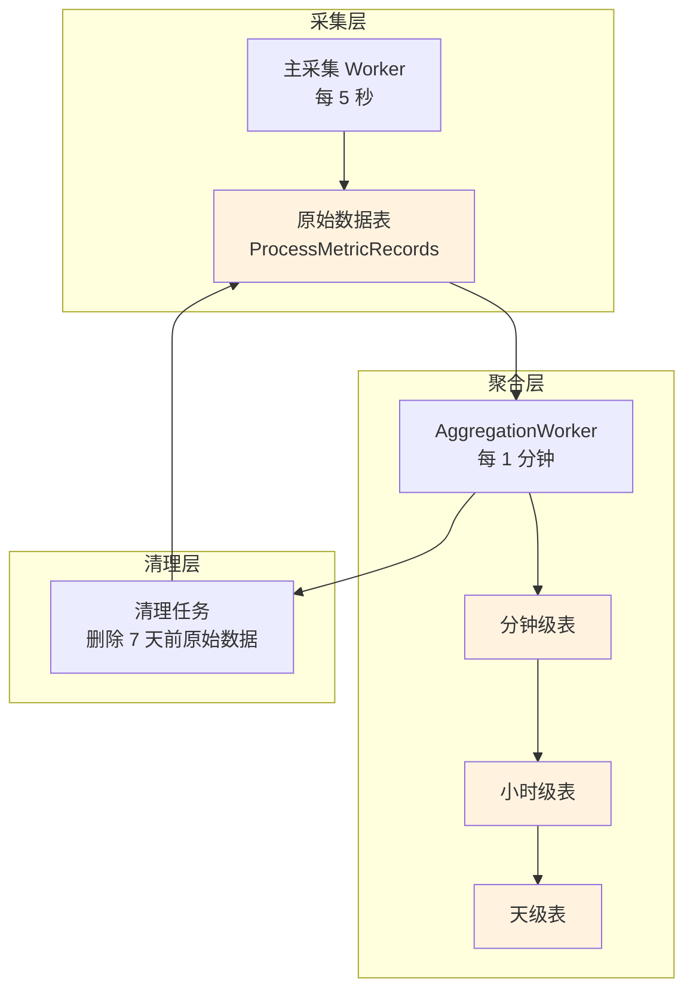

# AggregationWorker (聚合工作器)

AggregationWorker 是后台服务，负责将原始指标数据聚合成不同时间粒度的统计数据，以加速历史数据查询和减少存储空间占用。

## 什么是 AggregationWorker？

AggregationWorker 是一个 ASP.NET Core 的 `BackgroundService`，定期扫描原始数据并聚合成分钟级、小时级、天级的统计数据。它确保历史查询能够快速返回，同时大幅减少数据量。

**关键特征**:
- 后台定时执行
- 分层聚合（分钟/小时/天）
- 数学正确的加权平均
- 自动清理过期原始数据

## 代码位置

| 方面 | 位置 |
|------|------|
| 实现 | `XhMonitor.Service/Workers/AggregationWorker.cs` |
| 聚合实体 | `XhMonitor.Core/Entities/AggregatedMetricRecord.cs` |
| 聚合级别枚举 | `XhMonitor.Core/Enums/AggregationLevel.cs` |

## 结构

```csharp
public class AggregationWorker : BackgroundService
{
    protected override async Task ExecuteAsync(CancellationToken stoppingToken)
    {
        while (!stoppingToken.IsCancellationRequested)
        {
            // 1. 聚合分钟级数据
            await AggregateAsync(AggregationLevel.Minute, TimeSpan.FromMinutes(1));
            
            // 2. 聚合小时级数据
            await AggregateAsync(AggregationLevel.Hour, TimeSpan.FromHours(1));
            
            // 3. 聚合天级数据
            await AggregateAsync(AggregationLevel.Day, TimeSpan.FromDays(1));
            
            // 4. 清理过期原始数据
            await CleanupOldRawDataAsync(TimeSpan.FromDays(7));
            
            await Task.Delay(TimeSpan.FromMinutes(1), stoppingToken);
        }
    }
}
```

## 聚合级别

| 级别 | 时间窗口 | 触发频率 | 典型用途 |
|------|---------|---------|---------|
| `Raw` | 5 秒 | - | 实时监控、告警判断 |
| `Minute` | 1 分钟 | 每分钟 | 短期趋势、性能分析 |
| `Hour` | 1 小时 | 每小时 | 中期趋势、容量规划 |
| `Day` | 1 天 | 每天一次 | 长期统计、报表 |

## 聚合计算

为了保证数学正确性，系统存储累加值和计数，而非平均值：

### 原始数据
```json
[
  { "value": 45, "timestamp": "2025-01-09T10:00:00Z" },
  { "value": 55, "timestamp": "2025-01-09T10:00:05Z" },
  { "value": 50, "timestamp": "2025-01-09T10:00:10Z" }
]
```

### 聚合结果（分钟级）
```json
{
  "sum": 150,     // 45 + 55 + 50
  "count": 3,      // 3 个采样点
  "avg": 50,       // 150 / 3
  "min": 45,       // 最小值
  "max": 55,       // 最大值
  "timestamp": "2025-01-09T10:00:00Z"
}
```

### 为什么使用 Sum/Count？

- 支持跨时间段的加权平均
- 避免累积误差（avg of avg ≠ real avg）
- 允许灵活的后处理

## 数据流程



## 使用场景

### 查询聚合数据

```csharp
// 查询最近 1 小时的分钟级聚合数据
var metrics = await repository.GetAggregatedMetricsAsync(
    processId: 1234,
    level: AggregationLevel.Minute,
    from: DateTime.UtcNow.AddHours(-1),
    to: DateTime.UtcNow
);

// metrics 包含 60 条记录（每分钟一条）
```

### API 端点

```bash
# 查询小时级数据
GET /api/v1/metrics/history?processId=1234&aggregation=hour&from=2025-01-09T00:00:00Z&to=2025-01-09T23:59:59Z

# 查询所有聚合数据
GET /api/v1/metrics/aggregations?from=2025-01-09T00:00:00Z&to=2025-01-09T10:00:00Z&aggregation=minute
```

## 性能优化

### 索引策略

数据库表需要以下索引以提高查询性能：

```sql
-- 原始数据表
CREATE INDEX IX_ProcessMetricRecords_ProcessId_Timestamp
ON ProcessMetricRecords(ProcessId, Timestamp DESC);

-- 聚合数据表
CREATE INDEX IX_AggregatedMetricRecords_ProcessId_Level_Timestamp
ON AggregatedMetricRecords(ProcessId, AggregationLevel, Timestamp DESC);
```

### 数据清理

- 原始数据保留 7 天（可配置）
- 聚合数据长期保留
- 清理任务在聚合后执行

## 配置参数

| 参数 | 默认值 | 描述 |
|------|--------|------|
| `Interval` | 1 分钟 | 聚合执行间隔 |
| `RawRetention` | 7 天 | 原始数据保留期 |
| `AggregationLevels` | Minute, Hour, Day | 启用的聚合级别 |

## 不变量

1. **时间窗口完整性**: 每个聚合级别覆盖所有时间范围（无空洞）
2. **数学一致性**: Sum / Count 必须等于 Avg（允许浮点误差）
3. **单调递增**: AggregatedMetricRecord.Id 单调递增
4. **原子性**: 聚合和清理在同一事务中完成

## 故障恢复

### 重启后处理

- AggregationWorker 启动时检查未聚合的原始数据
- 补聚合缺失的时间窗口
- 确保所有原始数据都被正确聚合

### 数据一致性

- 使用数据库事务确保原子性
- 聚合失败时回滚，不影响原始数据
- 可手动触发重聚合（如需要）

## 未来改进

- [ ] 支持自定义聚合函数（P50, P90, P95, P99）
- [ ] 配置化聚合策略（窗口大小、触发条件）
- [ ] 支持多进程聚合（全局统计）
- [ ] 添加聚合数据导出功能
- [ ] 实现增量聚合优化（只处理新增数据）
