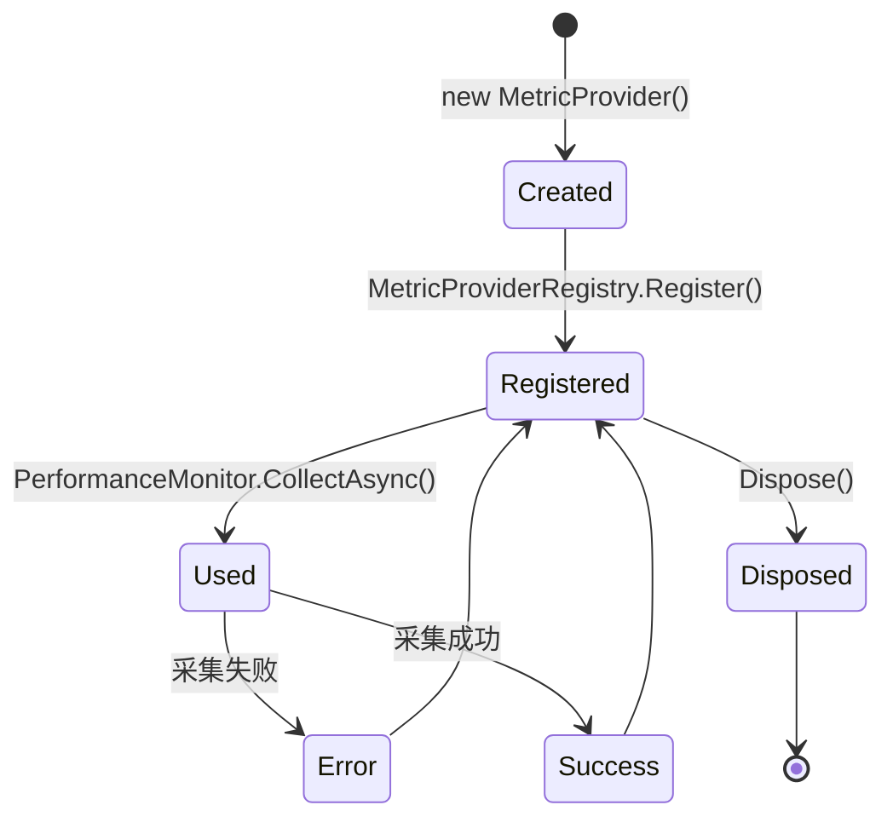
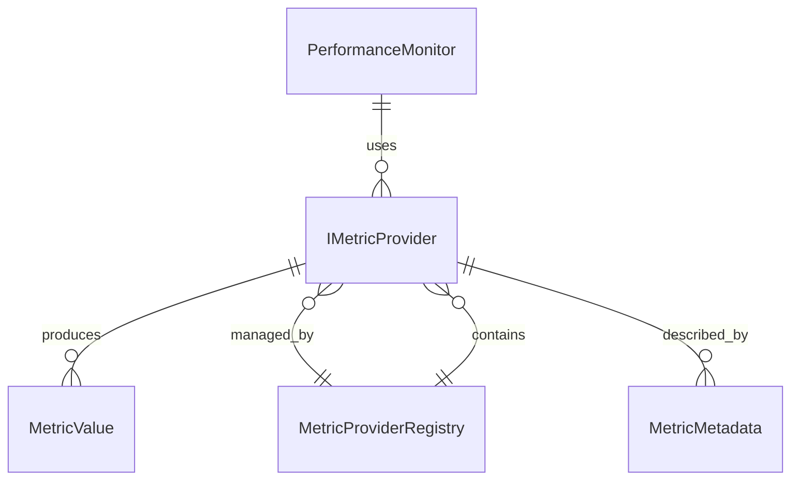

# MetricProvider (指标提供者)

MetricProvider 是系统中负责采集特定类型指标数据的组件接口，通过插件化架构实现灵活的指标扩展。

## 什么是 MetricProvider？

MetricProvider 实现了 `IMetricProvider` 接口，定义了如何从 Windows 系统中采集特定指标（如 CPU、内存、GPU、显存等）。每个提供者专注于单一指标类型，可以独立开发和测试。

**关键特征**:
- 基于接口的插件化设计
- 支持异步采集
- 可检测平台支持性
- 前端自动发现，无需修改代码

## 代码位置

| 方面 | 位置 |
|------|------|
| 接口定义 | `XhMonitor.Core/Interfaces/IMetricProvider.cs` |
| 实现类 | `XhMonitor.Core/Providers/` |
| 注册管理 | `XhMonitor.Service/Core/MetricProviderRegistry.cs` |
| 前端配置 API | `XhMonitor.Service/Controllers/ConfigController.cs` |

## 结构

```csharp
public interface IMetricProvider : IDisposable
{
    string MetricId { get; }           // 指标唯一标识
    string DisplayName { get; }        // 显示名称
    string Unit { get; }              // 单位
    MetricType Type { get; }          // 指标类型
    bool IsSupported();               // 是否支持
    Task<MetricValue> CollectAsync(int processId);  // 采集
    void Dispose();                   // 释放资源
}
```

### 内置提供者

| 提供者 | MetricId | 描述 |
|--------|----------|------|
| `CpuMetricProvider` | `cpu` | CPU 使用率 (%) |
| `MemoryMetricProvider` | `memory` | 内存使用量 (MB) |
| `GpuMetricProvider` | `gpu` | GPU 使用率 (%) |
| `VramMetricProvider` | `vram` | 显存使用量 (MB) |

## 使用场景

### 添加自定义指标

1. 实现 `IMetricProvider` 接口
2. 实现 `CollectAsync` 方法采集数据
3. 前端通过 `/api/v1/config/metrics` 自动发现

```csharp
public class DiskMetricProvider : IMetricProvider
{
    public string MetricId => "disk";
    public string DisplayName => "Disk Usage";
    public string Unit => "MB";
    public MetricType Type => MetricType.Gauge;

    public bool IsSupported() => true;

    public async Task<MetricValue> CollectAsync(int processId)
    {
        var diskUsage = await GetDiskUsageAsync(processId);
        return new MetricValue { Value = diskUsage, Unit = Unit };
    }

    public void Dispose() { }
}
```

## 生命周期



## 关系



## 限制

- 采集超时时间固定为 2 秒
- 目前串行采集（`MaxDegreeOfParallelism=1`）
- 错误时返回 `MetricValue.Error`，不会重试

## 未来改进

- 支持并行采集提高性能
- 配置化超时和重试策略
- 支持依赖关系的指标（如显存依赖 GPU）
