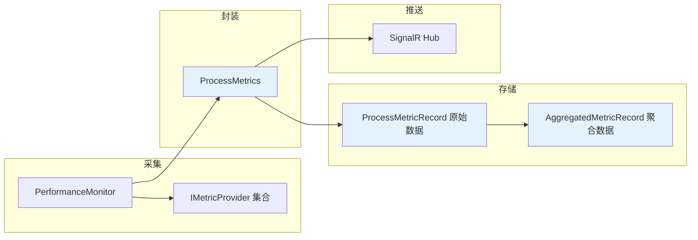
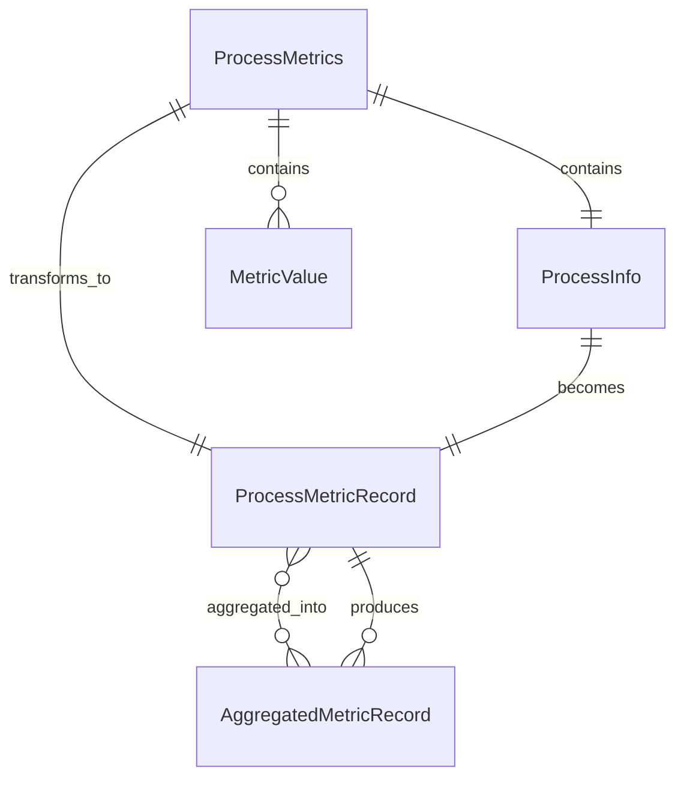

# ProcessMetrics (进程指标)

ProcessMetrics 是系统中的核心数据结构，表示单个进程在特定时间点的所有指标采集结果。

## 什么是 ProcessMetrics？

ProcessMetrics 是一个数据容器，包含了进程的基本信息以及在该采集周期内所有可用指标的最新值。它是数据采集、存储和传递的核心单元。

**关键特征**:
- 包含进程元信息（PID、名称、命令行）
- 包含多个指标的字典（Key 为 MetricId）
- 包含采集时间戳
- 不可变设计，确保数据一致性

## 代码位置

| 方面 | 位置 |
|------|------|
| 数据模型 | `XhMonitor.Core/Models/ProcessMetrics.cs` |
| 数据实体 | `XhMonitor.Core/Entities/ProcessMetricRecord.cs` |
| 聚合实体 | `XhMonitor.Core/Entities/AggregatedMetricRecord.cs` |
| 仓库接口 | `XhMonitor.Core/Interfaces/IProcessMetricRepository.cs` |

## 结构

```csharp
public class ProcessMetrics
{
    public ProcessInfo Info { get; set; }        // 进程信息
    public Dictionary<string, MetricValue> Metrics { get; set; }  // 指标字典
    public DateTime Timestamp { get; set; }      // 采集时间
}

public class ProcessInfo
{
    public int ProcessId { get; set; }          // 进程 ID
    public string ProcessName { get; set; }     // 进程名称
    public string? CommandLine { get; set; }     // 命令行
}

public class MetricValue
{
    public double Value { get; set; }            // 指标值
    public string Unit { get; set; }            // 单位
    public string? ErrorMessage { get; set; }   // 错误信息
}
```

## 数据流向



## 聚合机制

系统支持分层聚合，将原始数据聚合成不同时间粒度的统计数据：

| 聚合级别 | 时间窗口 | 典型用途 |
|---------|---------|---------|
| Raw | 5 秒 | 实时监控 |
| Minute | 1 分钟 | 短期趋势分析 |
| Hour | 1 小时 | 中期分析 |
| Day | 1 天 | 长期统计 |

### 聚合计算方式

每个聚合级别存储以下统计信息：
- **Sum**: 所有值的总和（用于计算加权平均）
- **Count**: 采样次数
- **Avg**: 平均值 = Sum / Count
- **Min**: 最小值
- **Max**: 最大值

## 使用场景

### 采集与存储

```csharp
// PerformanceMonitor 采集后创建 ProcessMetrics
var metrics = new ProcessMetrics
{
    Info = processInfo,
    Metrics = collectedMetrics,  // { "cpu": MetricValue, "memory": MetricValue }
    Timestamp = DateTime.UtcNow
};

// 保存到数据库（转换为 ProcessMetricRecord）
await repository.SaveMetricsAsync(metrics);
```

### 查询历史数据

```csharp
// 查询原始数据
var rawMetrics = await repository.GetMetricsAsync(
    processId: 1234,
    from: DateTime.UtcNow.AddHours(-1),
    to: DateTime.UtcNow
);

// 查询聚合数据
var aggMetrics = await repository.GetAggregatedMetricsAsync(
    processId: 1234,
    level: AggregationLevel.Minute,
    from: DateTime.UtcNow.AddHours(-1),
    to: DateTime.UtcNow
);
```

### 实时推送

```csharp
// SignalR 广播 ProcessMetrics
await _hubContext.Clients.All.SendAsync(
    "BroadcastMetrics",
    processMetricsList
);
```

## 不变量

这些规则对有效的 ProcessMetrics 必须始终成立：

1. **时间戳一致性**: 同一批次的 ProcessMetrics 必须有相同的时间戳
2. **进程 ID 唯一性**: 同一批次中每个进程 ID 只出现一次
3. **指标完整性**: 每个指标必须有对应的 MetricValue
4. **非负值**: MetricValue.Value 必须为非负数（错误状态除外）

## 关系



## 性能考虑

**当前限制**:
- 采集周期: 5 秒
- 单次采集进程数: 取决于配置关键词
- 数据库写入: 批量提交

**优化建议**:
- 使用进程关键词过滤减少监控数量
- 定期清理历史数据
- 考虑数据压缩存储

## 未来改进

- [ ] 支持指标依赖关系（如显存依赖 GPU）
- [ ] 实现增量数据推送
- [ ] 支持自定义聚合函数
- [ ] 添加数据压缩和归档功能
