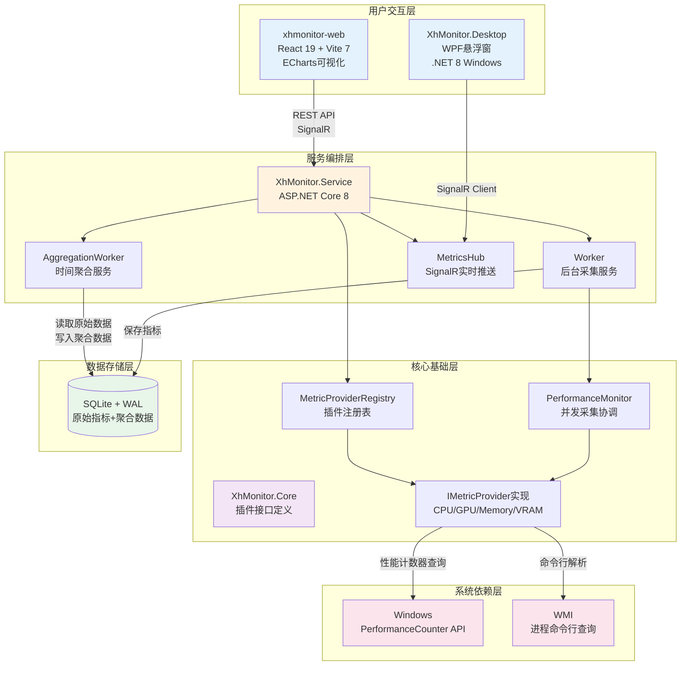

# 总体架构

XhMonitor是一个Windows平台资源监控系统,旨在解决跨进程性能指标采集、多维度数据聚合和实时可视化的核心业务问题。系统在Windows生态中扮演着系统性能分析工具的角色,为开发者和运维人员提供进程级别的资源消耗洞察能力。其设计理念在于通过插件化架构实现指标扩展的灵活性,同时通过分层聚合策略平衡实时性与历史数据查询的性能需求。

## 架构范式

系统采用分层架构与插件化设计相结合的混合架构范式。从纵向层次划分,系统分为核心基础层(Core)、服务编排层(Service)和用户交互层(Web/Desktop)。这一范式选择源于对系统可扩展性与可维护性的权衡:核心层封装了Windows性能计数器API的复杂性,服务层通过ASP.NET Core的依赖注入容器实现组件生命周期管理,而交互层则通过SignalR的双向通信协议保障数据实时推送的低延迟特性。

采用该范式的根本原因在于应对Windows性能监控的三大技术挑战。其一,PerformanceCounter API的线程阻塞特性要求在核心层实现信号量控制的并发限流(实现位于`XhMonitor.Service.Core.PerformanceMonitor:103`,通过SemaphoreSlim限制并发度为8)。其二,不同硬件平台对GPU/VRAM指标的支持差异性要求在插件注册阶段通过`IsSupported()`接口过滤不兼容的提供者(实现位于`XhMonitor.Service.Core.MetricProviderRegistry:65-82`)。其三,长时间运行的后台服务需要处理进程生命周期波动,系统通过三层异常屏障(提供者级超时、进程级跳过、周期级重试)确保单点故障不传播至整体采集流程。

## 核心技术决策

### 数据存储策略

系统选用SQLite作为持久化方案,并启用WAL(Write-Ahead Logging)模式以提升并发读写性能(数据库初始化位于`XhMonitor.Service.Data.MonitorDbContext:13`)。这一决策基于资源监控系统的数据特征分析:原始指标数据具有高频写入(5秒间隔)、低查询频次(历史回溯)的访问模式,SQLite的嵌入式特性消除了独立数据库进程的部署复杂性,而WAL模式通过允许读写并发显著缓解了数据采集周期中的写锁竞争。

指标数据以JSON格式存储于`MetricsJson`字段,辅以数据库级别的CHECK约束(`json_valid(MetricsJson)`)确保数据完整性。该设计使得新增指标类型无需变更表结构,仅需注册对应的`IMetricProvider`实现即可。此灵活性支撑了系统的核心扩展性需求——从内置的CPU/Memory/GPU/VRAM四类指标扩展至用户自定义指标时,前端通过`/api/v1/config/metrics`端点动态获取元数据(包括单位、颜色、图标),实现零代码修改的指标渲染(配置端点实现位于`XhMonitor.Service.Controllers.ConfigController`)。

### 时间聚合架构

系统实现了三层时间窗口聚合:原始数据(Raw)→分钟聚合→小时聚合→天聚合,存储结构通过`AggregationLevel`枚举区分(定义于`XhMonitor.Core.Enums.AggregationLevel`)。聚合过程由独立的后台服务`AggregationWorker`以分钟级触发频率执行,计算Min/Max/Avg/Sum/Count五类统计值。这一设计解决了长时间范围查询的性能瓶颈——查询7天原始数据需扫描约12万条记录(以5秒间隔、50进程计算),而查询7天的小时聚合仅需访问168条记录,查询成本降低两个数量级。

聚合算法采用加权平均策略(Avg = Sum / Count),避免了简单平均值在采样密度不均匀时的失真问题。例如,某分钟内进程可能仅存活30秒,若直接对该时段的6个采样点求平均,将低估该进程在存活期间的实际资源占用。通过存储Sum和Count,上层聚合可准确还原跨时间窗口的平均值,确保统计数据的数学正确性。

### 实时通信机制

系统采用SignalR WebSocket协议实现后端到前端的实时推送,定义了三类事件通道:`metrics.latest`(进程指标,5秒周期)、`metrics.system`(系统总览,1秒周期)和`metrics.limits`(硬件容量,小时级更新)。这一设计避免了传统轮询模式下前端的定时器管理复杂性,同时通过自动重连机制(`.withAutomaticReconnect()`)处理网络闪断场景。

事件频率的差异化设计源于数据时效性与带宽消耗的平衡。系统级CPU/GPU使用率变化频繁,1秒推送可支撑实时波形图的流畅渲染;而进程级指标采集涉及大量PerformanceCounter查询(耗时8-9秒,来源于README性能测试数据),5秒间隔已接近采集周期上限,进一步提升频率将导致周期重叠。硬件容量(总内存/显存)为静态配置,仅在系统启动和VRAM检测(每小时触发,实现位于`XhMonitor.Service.Worker:145-169`)时推送,最小化无效数据传输。

## 顶层模块划分

系统在最高层级被划分为四个逻辑单元:XhMonitor.Core(核心抽象层)、XhMonitor.Service(服务编排层)、xhmonitor-web(Web展示层)和XhMonitor.Desktop(桌面客户端层)。其中Core层定义了`IMetricProvider`插件接口、`ProcessMetricRecord`数据实体和`MetricType`类型枚举,确立了系统的领域模型边界。Service层实现了三个关键组件:`MetricProviderRegistry`(插件注册表,支持运行时从`plugins`目录加载DLL)、`PerformanceMonitor`(并发采集协调器)和`Worker`(后台服务编排器),三者通过依赖注入容器协同工作。

模块间的高层协作机制体现为单向依赖流:Service层依赖Core层接口,Web/Desktop层依赖Service层提供的HTTP API和SignalR Hub。这一设计确保了核心领域逻辑(如何定义指标、如何存储数据)与基础设施关注点(如何启动HTTP服务、如何渲染图表)的解耦。例如,当新增温度监控指标时,仅需在Core层实现`IMetricProvider`,在Service层的`MetricProviderRegistry.RegisterBuiltInProviders()`中注册实例,前端即可通过现有的配置接口自动感知并渲染新指标,无需修改Web层任何TypeScript代码。

Desktop层作为独立的WPF应用程序,通过SignalR Client订阅Service层的事件流,实现悬浮窗实时显示功能。其与Web层的职责边界在于:Web层面向全面的数据分析场景(历史趋势、进程列表、聚合查询),Desktop层聚焦于桌面环境的轻量级监控(悬浮窗、托盘图标、系统集成)。两者共享相同的后端服务,但通过不同的UI范式(浏览器 vs 原生窗口)服务于差异化的用户场景。

系统的设计意图在于构建一个可持续演进的监控平台。插件化架构使得第三方开发者可通过实现`IMetricProvider`接口扩展监控维度(如网络流量、磁盘IO),而无需修改核心代码库。分层聚合策略确保系统在处理长期历史数据时的查询性能,避免因原始数据膨胀导致的响应退化。SignalR的实时推送机制消除了前端轮询逻辑,降低了客户端实现的复杂度,同时为后续的告警通知、阈值触发等功能预留了基础设施。这些技术选型共同支撑了系统在性能、扩展性和可维护性三个维度的非功能性需求。
