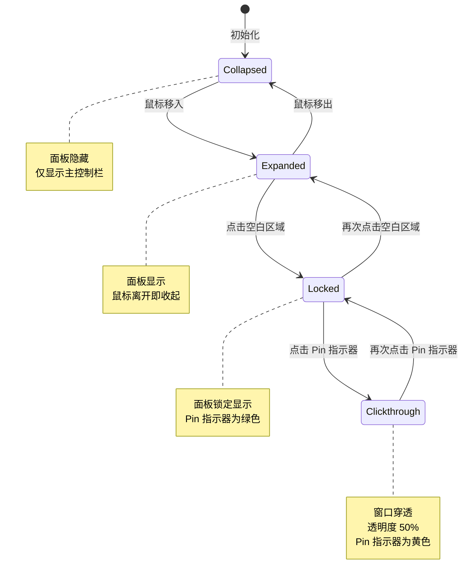

# 📊 xhMonitor 桌面悬浮窗交互设计稿

> **文档版本**: v1.1
> **创建日期**: 2025-12-28
> **更新日期**: 2025-12-29
> **设计目标**: 轻量级、非侵入式的系统性能监控悬浮窗 (WPF 实现)

---

## 🎯 **一、主控制栏 (Monitor Bar) 交互**

### 1. **拖拽移动**
- **触发**: 在主控制栏区域按住鼠标左键拖动,移动距离超过阈值
- **行为**: 悬浮窗跟随鼠标移动到新位置
- **实现**: `FloatingWindow.xaml.cs` 中的拖拽逻辑 (line 264-293)
- **技术细节**:
  - 移动阈值: 5px (`DRAG_THRESHOLD`, line 20, 避免点击和长按误触发拖动)
  - 拖动检测: `MonitorBar_PreviewMouseMove` 计算鼠标移动距离
  - 拖动标志: `_isDragging` 防止拖动时触发点击/长按逻辑
  - 位置保存: 窗口关闭时自动持久化到 `%AppData%\XhMonitor.Desktop\window.json`
  - 边界检测: `ApplyPlacement()` 确保窗口不会超出屏幕可视区域 (line 457-471)

### 2. **悬停展开面板**
- **触发**: 鼠标移入主控制栏 (`MonitorBar_MouseEnter`, line 224-228)
- **行为**:
  - 状态从 `Collapsed` → `Expanded`
  - 详情面板 (DetailsPopup) 通过 WPF Popup 控件弹出显示
- **实现**: `FloatingWindowViewModel.OnBarPointerEnter()` (line 102-106)
- **动画**: WPF Popup 自带淡入淡出效果

### 3. **离开收起面板**
- **触发**: 鼠标移出主控制栏区域 (`MonitorBar_MouseLeave`, line 230-237)
- **行为**:
  - 状态从 `Expanded` → `Collapsed`
  - 详情面板自动隐藏
  - 如果正在拖动,停止拖动 (`_isDragging = false`)
- **实现**: `FloatingWindowViewModel.OnBarPointerLeave()` (line 108-112)
- **延迟**: 无延迟,立即响应

### 4. **点击锁定/解锁** ✅
- **触发**: 在主控制栏短按 (非指标区域, 非拖动)
- **行为**:
  - `Expanded` → `Locked`: 面板保持显示,不受鼠标移出影响
  - `Locked` → `Expanded`: 解除锁定,面板会在鼠标离开时收起
  - `Collapsed` 状态不响应点击 (需先鼠标移入进入 `Expanded` 状态)
- **实现**:
  - `MonitorBar_PreviewMouseUp` (line 296-331) 处理鼠标抬起事件
  - `FloatingWindowViewModel.OnBarClick()` (line 114-128) 执行状态切换
  - 拖动和长按保护: 如果 `_isDragging` 或 `_longPressTriggered` 为真,跳过点击逻辑
- **视觉反馈**:
  - 锁定时控制栏边框变为绿色 (通过 `IsLocked` 属性绑定)
  - Pin 指示器显示为绿色圆点
  - 控制栏背景略微加深

---

## 🎯 **二、Pin 指示器交互**

### 5. **切换穿透模式**
- **触发**: 在 `Locked` 状态下点击 Pin 指示器 (`PinIndicator_Click`, line 396-401)
- **行为**:
  - `Locked` → `Clickthrough`: 整个窗口变为穿透模式
    - 悬浮窗透明度降低至 50% (通过 `IsClickthrough` 属性控制)
    - 背景变为半透明
    - 鼠标点击可穿透窗口到下层应用 (通过 `WS_EX_TRANSPARENT` 窗口样式实现)
    - 注册热键 `Ctrl+Alt+Shift+X` 用于退出穿透模式
  - `Clickthrough` → `Locked`: 通过热键恢复正常交互
    - 注销热键
    - 恢复到进入穿透前的状态 (`_stateBeforeClickthrough`)
- **实现**:
  - 进入: `FloatingWindowViewModel.EnterClickthrough()` (line 130-134)
  - 退出: `FloatingWindowViewModel.ExitClickthrough()` (line 136-140) + 热键处理 (line 530-543)
  - 窗口样式控制: `SetClickThrough()` (line 167-186)
- **视觉反馈**:
  - 穿透模式下 Pin 指示器变为**黄色** (通过 `IsClickthrough` 属性绑定)
  - 窗口整体透明度降低
  - 面板自动收起
- **使用场景**: 游戏、全屏应用时需要穿透悬浮窗进行操作

### 6. **连接状态指示**
- **触发**: 后端 SignalR 连接状态变化
- **行为**:
  - **断开连接**: Pin 指示器显示为**红色** + 常显 (通过 `IsConnected` 属性控制)
  - **正常连接**: 根据锁定状态显示绿色或隐藏
- **实现**:
  - ViewModel: `OnConnectionStateChanged()` (line 156-160)
  - 连接初始化: `InitializeAsync()` 带重试机制 (line 207-233)
- **自动重连**:
  - 最多重试 10 次,每次间隔 2 秒 (总计 20 秒)
  - SignalR 自带的 `.WithAutomaticReconnect()` 机制

---

## 🎯 **三、指标长按交互 (扩展功能)**

### 7. **单个指标长按** ✅
> **当前状态**: 已实现 (WPF Desktop 版)

- **触发**: 在主控制栏上长按(2秒) CPU/RAM/GPU/VRAM 任一指标区域
- **行为**:
  - 触发长按计时器 (`DispatcherTimer`, 2秒间隔)
  - 长按触发后发出 `MetricActionRequested` 事件
  - 长按期间如果检测到拖动 (移动距离 > 5px),自动取消长按
  - 长按已触发时,松开鼠标不会执行点击锁定逻辑
- **实现位置**:
  - 鼠标按下: `MonitorBar_PreviewMouseDown` (line 240-261) 检测点击位置,启动计时器
  - 长按检测: `StartLongPress()` (line 355-382) 设置 `_longPressTriggered` 标志
  - 拖动保护: `MonitorBar_PreviewMouseMove` (line 264-293) 检测拖动并取消长按
  - 鼠标抬起: `MonitorBar_PreviewMouseUp` (line 296-331) 根据标志跳过点击逻辑
  - 计时器停止: `StopLongPressTimer()` (line 384-394)
- **视觉反馈**:
  - 指标区域鼠标光标变为手型 (`Cursor="Hand"`)
  - 长按触发时发出事件,由 `App.xaml.cs` 处理具体动作
- **交互优化**:
  - 使用 `PreviewMouseDown/Up` 事件,优先处理
  - 通过 `FindParentWithTag()` (line 343-353) 查找带 Tag 的父元素识别指标
  - 鼠标移出主控制栏时自动取消长按 (`MonitorBar_MouseLeave`)
  - 长按和拖动互斥,拖动优先级更高
- **配置支持**:
  - 事件参数: `MetricActionEventArgs` (line 615-619) 包含 `MetricId` 和 `Action`
  - 由外部订阅者决定具体执行的动作 (打开任务管理器、GPU设置等)

### 配置示例 (外部应用层处理)
```csharp
// 在 App.xaml.cs 中订阅事件
_floatingWindow.MetricActionRequested += OnMetricActionRequested;

private void OnMetricActionRequested(object? sender, MetricActionEventArgs e)
{
    switch (e.MetricId)
    {
        case "cpu":
            Process.Start("taskmgr.exe");
            break;
        case "gpu":
            // 打开GPU设置
            break;
    }
}
```

---

## 🎯 **四、进程列表交互 (Details Panel)**

### 8. **进程行右键菜单 - 钉住/取消钉住**
- **触发**: 在进程列表中任意进程行右键 (`ProcessRow_RightClick`, line 413-421)
- **行为**:
  - **未钉住 → 钉住**:
    - 进程行添加 📌 图标 (绿色, 9px)
    - 该进程添加到 **PinnedProcesses** 集合 (顶部固定卡片区域)
    - 卡片自动添加到顶部
  - **钉住 → 取消钉住**:
    - 移除 📌 图标
    - 从 **PinnedProcesses** 集合移除
- **实现**:
  - `FloatingWindowViewModel.TogglePin()` (line 142-154)
  - 数据同步: `SyncPinnedCollection()` (line 310-317)
  - 集合管理: `_pinnedProcessIds` HashSet 存储已固定的进程ID
- **数据持久化**: 当前仅在内存中,进程退出时自动清理 (line 303-307)

### 9. **进程行悬停高亮**
- **触发**: 鼠标悬停在进程行
- **行为**: WPF 的 Trigger 自动处理悬停效果
- **实现**: XAML 样式定义

### 10. **进程列表滚动**
- **触发**: 进程数量超过面板高度
- **行为**: 自动显示滚动条
- **实现**: WPF `ScrollViewer` 控件

---

## 🎯 **五、Pinned Card 交互**

### 11. **钉住卡片右键取消钉住**
- **触发**: 在顶部钉住卡片上右键 (`PinnedCard_UnpinClick`, line 403-411)
- **行为**:
  - 卡片从 `PinnedProcesses` 集合移除
  - 详情列表中对应进程的 📌 图标消失
- **实现**: 调用 `TogglePin()` 方法,与进程列表共用同一逻辑

### 12. **钉住卡片悬停效果**
- **触发**: 鼠标悬停在钉住卡片
- **行为**: WPF 样式自动处理悬停效果
- **实现**: XAML Trigger 定义

### 13. **钉住卡片布局**
- **排列**: 垂直堆叠,通过 `ItemsControl` 绑定 `PinnedProcesses` 集合
- **尺寸**: 固定宽度 320px,高度自适应内容
- **间距**: 卡片间距由 ItemsControl 的 Margin 控制
- **对齐**: 水平居中对齐
- **内容**:
  - 进程名 (左对齐,超长省略号 `TextTrimming="CharacterEllipsis"`)
  - VRAM (青色, `MemoryConverter` 格式化)
  - GPU (阈值颜色, `MetricValueColorConverter`)
  - CPU (阈值颜色, `MetricValueColorConverter`)
  - RAM (青色, `MemoryConverter` 格式化)

---

## 🎯 **六、动画与视觉反馈**

### 14. **面板弹出方向自适应** ✅
- **触发**: Popup 打开时根据窗口位置自动计算
- **行为**:
  - 根据屏幕剩余空间决定向上或向下弹出
  - 计算逻辑考虑窗口位置、屏幕工作区域、Popup 所需空间
  - Pinned Stack (固定卡片) 根据 Popup 方向自动调整位置
- **实现**:
  - Popup 位置: `OnCustomPopupPlacement()` (line 69-131)
  - Pinned Stack 定位: `UpdatePinnedStackPlacement()` (line 133-149)
  - 集合变化监听: `OnPinnedProcessesChanged()` (line 151-155)
  - 窗口尺寸变化: `OnWindowSizeChanged()` (line 157-160)
- **核心逻辑**:
  - 上方空间充足 → 向上弹出, Pinned Stack 置于 Grid.Row=0
  - 下方空间充足 → 向下弹出, Pinned Stack 置于 Grid.Row=2
  - 两边空间都不足 → 选择空间较大的一侧
- **Pinned Stack 自适应**:
  - 向上弹出时: Pinned Stack 在上方,底部 Margin=8px
  - 向下弹出时: Pinned Stack 在下方,顶部 Margin=8px

### 15. **数据更新动画**
- **WPF 自动处理**: 通过 ObservableCollection 自动更新 UI
- **防闪烁机制**:
  - `SyncCollectionOrder()` (line 319-348) 使用差异算法
  - 仅更新变化的项,避免重建整个列表
  - 使用 `Move()` 而非 `Remove/Add` 保持引用

### 16. **数值颜色阈值渐变**
- **触发**: 指标数值变化
- **行为**:
  - **性能类指标** (CPU/GPU):
    - 0-49%: 绿色 (`#4ade80`)
    - 50-79%: 黄色 (`#facc15`)
    - 80-100%: 红色 (`#f87171`)
  - **内存类指标** (RAM/VRAM): 固定青色 (`#22d3ee`)
- **实现**:
  - `MetricValueColorConverter` - 性能指标颜色转换
  - `MemoryPercentageColorConverter` - 内存百分比颜色转换
- **应用范围**:
  - 进度条颜色 (ProgressBar Foreground 绑定)
  - CPU/GPU 数值文本颜色
  - 钉住卡片中的指标值颜色

### 17. **进度条样式**
- **高度**: 主控制栏 3px (`ThinProgressBar` 样式)
- **圆角**: 1.5px
- **背景**: 半透明白色 (`ColorProgressBg` = `#1AFFFFFF`)
- **前景**: 动态颜色,通过 Converter 绑定
- **实现**: WPF ControlTemplate 自定义样式

---

## 🎯 **七、键盘与辅助交互**

### 18. **热键退出穿透模式** ✅
> **当前状态**: 已实现

- **触发**: 在穿透模式下按下 `Ctrl+Alt+Shift+X`
- **行为**:
  - 退出穿透模式
  - 恢复到进入穿透前的状态
  - 注销热键
- **实现**:
  - 热键注册: `RegisterExitHotkey()` (line 499-516)
  - 热键处理: `WndProc()` 监听 `WM_HOTKEY` 消息 (line 530-543)
  - 热键注销: `UnregisterExitHotkey()` (line 518-528)
- **生命周期**: 仅在穿透模式激活时注册,退出时自动注销

### 19. **窗口位置持久化** ✅
> **当前状态**: 已实现

- **触发**: 窗口关闭时
- **行为**:
  - 保存窗口位置 (Left, Top) 和尺寸 (Width, Height)
  - 下次启动时自动恢复到上次位置
  - 边界检测确保窗口在屏幕可视区域内
- **实现**:
  - 保存: `WindowPositionStore.Save()` (line 578-603)
  - 加载: `WindowPositionStore.Load()` (line 563-576)
  - 应用: `ApplyPlacement()` (line 457-471)
  - 存储位置: `%AppData%\XhMonitor.Desktop\window.json`
- **数据格式**: JSON 格式存储 WindowPlacement 对象

---

## 📋 **交互状态机总结**



### 状态详细说明

| 状态 | 面板显示 | 交互性 | 透明度 | Pin 指示器 | 边框颜色 |
|------|---------|--------|--------|-----------|---------|
| **Collapsed** | ❌ 隐藏 | ✅ 完全交互 | 100% | ⚫ 隐藏 | 默认 (`rgba(255,255,255,0.08)`) |
| **Expanded** | ✅ 显示 | ✅ 完全交互 | 100% | ⚫ 隐藏 | 默认 |
| **Locked** | ✅ 显示 | ✅ 完全交互 | 100% | 🟢 绿色 | 绿色 (`rgba(74,222,128,0.5)`) |
| **Clickthrough** | ❌ 隐藏 | ❌ 仅 Pin 可交互 | 50% | 🟡 黄色发光 | 黄色 (`rgba(250,204,21,0.3)`) |

---

## 🔧 **配置相关交互**

### 20. **窗口位置持久化** ✅
> **当前状态**: 已实现

- **触发**: 窗口关闭时 (`OnClosing`, line 423-455)
- **行为**:
  - 窗口位置 (Left, Top) 和尺寸 (Width, Height) 保存到 JSON 文件
  - 下次启动时通过 `OnSourceInitialized` 自动恢复 (line 206-217)
  - 边界检测确保窗口在屏幕可视区域内
- **存储位置**: `%AppData%\XhMonitor.Desktop\window.json`
- **实现**: `WindowPositionStore` 内部类 (line 553-612)

---

## 📊 **数据更新频率**

| 数据类型 | 更新频率 | SignalR 事件 | ViewModel 处理 |
|---------|---------|-------------|----------------|
| **硬件限制** (MaxMemory/MaxVram) | 一次性推送 | `metrics.hardware` | `OnHardwareLimitsReceived` (line 162-170) |
| **系统使用率** (总CPU/GPU/RAM/VRAM) | 1秒 | `metrics.system` | `OnSystemUsageReceived` (line 172-184) |
| **进程指标** | 5秒 | `metrics.processes` | `OnProcessDataReceived` (line 186-205) |

### 数据流图示

```
后端 SignalR Hub
    │
    ├─→ metrics.hardware (一次性) ──→ FloatingWindowViewModel.OnHardwareLimitsReceived
    │                                  └─→ 更新 MaxMemory, MaxVram
    │
    ├─→ metrics.system (1秒) ──→ FloatingWindowViewModel.OnSystemUsageReceived
    │                             └─→ 更新 TotalCpu, TotalGpu, TotalMemory, TotalVram
    │
    └─→ metrics.processes (5秒) ──→ FloatingWindowViewModel.OnProcessDataReceived
                                    └─→ SyncProcessIndex (更新/新建 ProcessRowViewModel)
                                    └─→ SyncCollectionOrder (TopProcesses, AllProcesses)
                                    └─→ SyncPinnedCollection (PinnedProcesses)
```

### 数据同步机制
- **进程索引缓存**: `_processIndex` 字典缓存所有进程的 ViewModel,按 ProcessId 索引
- **差异算法**: `SyncCollectionOrder()` 仅更新变化的项,避免列表重建
- **自动清理**: 进程退出时自动从索引和固定列表中移除
- **线程安全**: 所有 UI 更新通过 `Dispatcher.Invoke` 在主线程执行

---

## 🎨 **视觉设计规范**

### 颜色系统

| 用途 | 颜色代码 | 变量名 |
|------|---------|--------|
| 成功/正常 (0-49%) | `#4ade80` | `ColorGreen` |
| 警告 (50-79%) | `#facc15` | `ColorYellow` |
| 危险 (80-100%) | `#f87171` | `ColorRed` |
| 内存类指标 | `#22d3ee` | `ColorCyan` |
| 主文本 | `#FFFFFF` | `ColorTextMain` |
| 次要文本 | `#88FFFFFF` (50% 透明) | `ColorTextSub` |
| 边框 | `#14FFFFFF` (8% 透明) | `ColorBorder` |
| 主背景 | `#990A0A0A` (60% 透明) | `ColorBackground` |
| 钉住卡片背景 | `#99141414` (60% 透明) | `ColorPinnedBg` |
| 进度条背景 | `#1AFFFFFF` (10% 透明) | `ColorProgressBg` |

### 字体规范

| 元素 | 字体 | 大小 | 粗细 |
|------|------|------|------|
| 主控制栏标签 | Segoe UI | 10px | Bold (700) |
| 主控制栏数值 | Consolas (等宽) | 12px | Bold (700) |
| 进程名 | Segoe UI | 11px | SemiBold (600) |
| 进程指标 | Consolas | 11px | Normal (400) |
| 表头 | Segoe UI | 9px | Bold (700) |
| 钉住卡片标签 | Segoe UI | 10px | Normal (400) |
| 钉住卡片数值 | Consolas | 11px | Bold (700) |

### 间距与尺寸

| 元素 | 尺寸 |
|------|------|
| 主控制栏圆角 | 8px |
| 主控制栏内边距 | 14px (左右), 6px (上下) |
| 钉住卡片圆角 | 4px |
| 钉住卡片宽度 | 320px |
| 钉住卡片左侧强调条 | 3px |
| Pin 指示器直径 | 8px |
| 进度条高度 (主控) | 3px |
| 进度条高度 (列表) | 2px |
| 详情面板最小宽度 | 360px |
| 详情面板最大高度 | 300px |

### 阴影效果

| 元素 | 阴影参数 |
|------|---------|
| 主控制栏 | `BlurRadius: 32px, Depth: 8px, Opacity: 0.4` |
| 详情面板 | `BlurRadius: 60px, Depth: 20px, Opacity: 0.6` |
| 钉住卡片 | `0 4px 12px rgba(0,0,0,0.3)` |
| Pin 指示器 (激活时) | `0 0 5px #4ade80` (发光效果) |

---

## 🔍 **交互细节优化**

### 防闪烁机制
1. **差异算法更新**:
   - 进程列表使用 `SyncCollectionOrder()` 差异算法 (line 319-348)
   - 仅更新变化的项,不重建整个列表
   - 使用 `Move()` 而非 `Remove/Add` 保持对象引用

2. **缓存机制**:
   - `_processIndex` 字典缓存进程 ViewModel (line 14)
   - 进程 ID 作为唯一标识符
   - 进程退出时自动清理缓存 (line 303-307)

3. **批量更新**:
   - SignalR 数据到达后,统一在 UI 线程更新
   - 使用 `Dispatcher.Invoke` 确保线程安全 (line 158-160, 164-169, 174-183, 188-204)

### 性能优化 (后端相关)
1. **并发度控制**:
   - 进程扫描并发度 4
   - Provider 采集并发度 8
   - 避免过多线程竞争

2. **超时保护**:
   - 每个 Provider 采集超时 2 秒
   - 防止单个进程阻塞整个采集周期

3. **数据库优化**:
   - SQLite WAL 模式避免写入冲突
   - 批量插入提升性能

---

## 📝 **实现状态总结**

| 交互点 | 状态 | 优先级 | 实现位置 |
|--------|------|--------|----------|
| 1. 拖拽移动 | ✅ 已实现 | P0 | FloatingWindow.xaml.cs (line 264-293) |
| 2-3. 悬停展开/收起 | ✅ 已实现 | P0 | FloatingWindowViewModel (line 102-112) |
| 4. 点击锁定/解锁 | ✅ 已实现 | P0 | FloatingWindowViewModel (line 114-128) |
| 5. 切换穿透模式 | ✅ 已实现 | P0 | SetClickThrough (line 167-186) + 热键 |
| 6. 连接状态指示 | ✅ 已实现 | P0 | InitializeAsync 带重试 (line 207-233) |
| 7. 指标长按 | ✅ 已实现 | P1 | FloatingWindow.xaml.cs (line 355-394) |
| 8. 进程行右键固定 | ✅ 已实现 | P0 | TogglePin (line 142-154) |
| 9-10. 进程列表交互 | ✅ 已实现 | P0 | WPF 自动处理 |
| 11-13. 固定卡片交互 | ✅ 已实现 | P0 | PinnedProcesses 集合绑定 |
| 14. 面板方向自适应 | ✅ 已实现 | P0 | OnCustomPopupPlacement (line 69-131) |
| 15-17. 动画与视觉反馈 | ✅ 已实现 | P0 | WPF Converters + 样式 |
| 18. 热键退出穿透 | ✅ 已实现 | P1 | WndProc (line 530-543) |
| 19. 窗口位置持久化 | ✅ 已实现 | P1 | WindowPositionStore (line 553-612) |

---

## 🚀 **后续迭代方向**

### 短期优化 (P1)
1. ✅ ~~实现指标长按功能~~ (已完成)
2. ✅ ~~位置持久化~~ (已完成)
3. ⏳ 完善长按动作配置系统 (在 App.xaml.cs 层实现)

### 中期增强 (P2)
1. 💡 双击进程行查看详情 (可实现 `ProcessActionRequested` 事件)
2. 💡 自定义主题配色
3. 💡 多显示器支持优化

### 长期规划 (P3)
1. 💡 历史数据图表展示
2. 💡 告警规则配置 (CPU/GPU 超阈值通知)
3. 💡 导出性能报告

---

## 📚 **参考文档**

- [架构分析文档](./architecture-analysis.md)
- [WPF 实现代码](../XhMonitor.Desktop/FloatingWindow.xaml)
- [ViewModel 逻辑](../XhMonitor.Desktop/ViewModels/FloatingWindowViewModel.cs)

---

**文档维护**: 本文档随功能迭代持续更新,当前版本反映截至 2025-12-29 的设计与实现状态。
