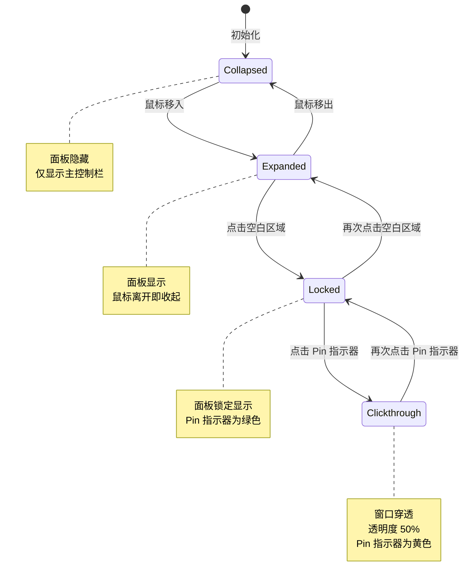

# 📊 xhMonitor 桌面悬浮窗交互设计稿

> **文档版本**: v1.0
> **创建日期**: 2025-12-28
> **设计目标**: 轻量级、非侵入式的系统性能监控悬浮窗

---

## 🎯 **一、主控制栏 (Monitor Bar) 交互**

### 1. **拖拽移动**
- **触发**: 在主控制栏区域按住鼠标左键拖动
- **行为**: 悬浮窗跟随鼠标移动到新位置
- **实现**: `FloatingWindow.xaml.cs` 中的拖拽逻辑
- **技术细节**:
  - 移动阈值: 3px (避免点击误触发拖动)
  - 位置保存: 自动持久化到配置文件
  - 边界检测: 防止拖出屏幕可视区域

### 2. **悬停展开面板**
- **触发**: 鼠标移入主控制栏
- **行为**:
  - 状态从 `Collapsed` → `Expanded`
  - 详情面板 (Process Panel) 弹出显示
- **实现**: `FloatingWindowViewModel.OnBarPointerEnter()` (line 102-106)
- **动画**: 淡入淡出 0.25s (`transition: all 0.25s`)

### 3. **离开收起面板**
- **触发**: 鼠标移出悬浮窗区域
- **行为**:
  - 状态从 `Expanded` → `Collapsed`
  - 详情面板隐藏
- **实现**: `FloatingWindowViewModel.OnBarPointerLeave()` (line 108-112)
- **延迟**: 无延迟,立即响应

### 4. **点击锁定/解锁** ✅
- **触发**: 在主控制栏点击 (非指标区域)
- **行为**:
  - `Expanded` → `Locked`: 面板保持显示,不受鼠标移出影响
  - `Locked` → `Expanded`: 解除锁定,面板会在鼠标离开时收起
- **实现**: `FloatingWindowViewModel.OnBarClick()` (line 114-128)
- **视觉反馈**:
  - 锁定时控制栏边框变为绿色 (`#4ade80`)
  - Pin 指示器显示为绿色圆点
  - 控制栏背景略微加深 (`rgba(5, 5, 5, 0.95)`)
- **修复说明**: 已修复只有 `Expanded` 和 `Locked` 状态才响应点击的逻辑

---

## 🎯 **二、Pin 指示器交互**

### 5. **切换穿透模式**
- **触发**: 点击右上角的圆点 (Pin Indicator)
- **行为**:
  - `Locked` → `Clickthrough`: 整个窗口变为穿透模式
    - 悬浮窗透明度降低至 50%
    - 背景变为半透明
    - 鼠标点击可穿透窗口到下层应用
    - **仅 Pin 指示器保持可交互**
  - `Clickthrough` → `Locked`: 恢复正常交互
- **实现**:
  - 进入: `FloatingWindowViewModel.EnterClickthrough()` (line 121-125)
  - 退出: `FloatingWindowViewModel.ExitClickthrough()` (line 127-131)
- **位置**: `FloatingWindow.xaml` line 293-318
- **视觉反馈**:
  - 穿透模式下 Pin 指示器变为**黄色** (`#facc15`) 并发光
  - 窗口整体透明度 50%
  - 控制栏边框颜色变为黄色
- **使用场景**: 游戏、全屏应用时需要穿透悬浮窗进行操作

### 6. **连接状态指示**
- **触发**: 后端 SignalR 连接状态变化
- **行为**:
  - **断开连接**: Pin 指示器显示为**红色** (`#f87171`) + 常显
  - **正常连接**: 根据锁定状态显示绿色或隐藏
- **实现**: `FloatingWindowViewModel.IsConnected` (line 85-90)
- **位置**: `FloatingWindow.xaml` line 301-303
- **自动重连**: 最多重试 10 次,每次间隔 2 秒 (总计 20 秒)

---

## 🎯 **三、指标长按交互 (扩展功能)**

### 7. **单个指标长按** ✅
> **当前状态**: 已实现 (WPF Desktop 版)

- **触发**: 长按(2秒) CPU/RAM/GPU/VRAM 任一指标区域
- **行为**: 根据配置执行动作
  - **CPU**: 打开任务管理器 (`openTaskManager`)
  - **GPU**: 打开 GPU 设置面板 (`openGpuSettings`)
  - **Power** (计划): 切换电源模式 (`togglePowerMode`)
  - **无配置**: 显示该指标的详细数据 (`showDetails`)
- **配置文件**: `XhMonitor.Service/data/widget-settings.json`
- **API 端点**:
  - `GET /api/v1/widgetconfig` (获取配置)
  - `POST /api/v1/widgetconfig/{metric}` (更新指标配置)
- **视觉反馈**:
  - 指标区域鼠标光标变为手型 (`Cursor="Hand"`)
  - 长按过程中可添加视觉进度提示(待实现)
- **交互优化**:
  - 使用 `PreviewMouseDown/Up` 事件,阻止事件冒泡到主控制栏
  - 鼠标移出指标区域时取消长按
  - 长按触发后不执行主控制栏的锁定逻辑
- **实现位置**:
  - XAML: `FloatingWindow.xaml` (line 237-306, 为每个指标 StackPanel 添加事件和 Tag)
  - C#: `FloatingWindow.xaml.cs` (line 205-259, 长按处理逻辑)

### 配置示例
```json
{
  "enableMetricClick": true,
  "metricClickActions": {
    "cpu": {
      "enabled": true,
      "action": "openTaskManager"
    },
    "power": {
      "enabled": true,
      "action": "togglePowerMode",
      "parameters": {
        "modes": "balanced,performance,powersaver"
      }
    }
  }
}
```

---

## 🎯 **四、进程列表交互 (Details Panel)**

### 8. **进程行右键菜单 - 钉住/取消钉住**
- **触发**: 在进程列表中任意进程行右键 → 选择 "Toggle Pin"
- **行为**:
  - **取消钉住 → 钉住**:
    - 进程行添加 📌 图标 (9px, 置灰)
    - 进程名变为绿色 (`#4ade80`)
    - 该进程添加到 **Pinned Stack** (顶部卡片区域)
    - 卡片带 `slideIn` 动画弹出
  - **钉住 → 取消钉住**:
    - 移除 📌 图标
    - 进程名恢复为白色
    - 从 Pinned Stack 移除 (带淡出动画)
- **实现**:
  - `FloatingWindowViewModel.TogglePin()` (line 133-145)
  - `ProcessRow_TogglePin` 事件处理器
- **位置**: `FloatingWindow.xaml` line 82
- **数据持久化**: 钉住的进程 ID 保存到 `_pinnedProcessIds` 集合

### 9. **进程行悬停高亮**
- **触发**: 鼠标悬停在进程行
- **行为**:
  - 进程名变为绿色 (`#4ade80`)
  - 光标变为 `context-menu` 提示可右键操作
- **位置**: HTML 设计稿 line 82 (`.proc-row:hover .name-main`)

### 10. **进程列表滚动**
- **触发**: 进程数量超过面板高度 (>300px)
- **行为**:
  - 自动显示滚动条
  - 滚动条样式与主题一致 (半透明)
- **实现**: `ScrollViewer` 组件 (line 365-374)

---

## 🎯 **五、Pinned Card 交互**

### 11. **钉住卡片右键取消钉住**
- **触发**: 在顶部钉住卡片上右键
- **行为**:
  - 卡片带淡出动画消失
  - 该进程从 `PinnedProcesses` 集合移除
  - 详情列表中对应进程的 📌 图标消失
- **实现**: 同上 `TogglePin()` 逻辑
- **位置**: HTML 设计稿 line 274 (`card.addEventListener('contextmenu'...)`)

### 12. **钉住卡片悬停效果**
- **触发**: 鼠标悬停在钉住卡片
- **行为**:
  - 背景色加深 (`rgba(40,40,40,0.9)`)
  - 卡片轻微放大 (`transform: scale(1.02)`)
  - 过渡动画 0.2s
- **位置**: HTML 设计稿 line 35 (`.pinned-card:hover`)

### 13. **钉住卡片布局**
- **排列**: 垂直堆叠,最新钉住的在顶部
- **尺寸**: 固定宽度 320px,高度自适应
- **间距**: 卡片间距 4px
- **对齐**: 水平居中对齐
- **内容**:
  - 进程名 (左对齐,超长省略号)
  - VRAM (青色 `#22d3ee`)
  - GPU (阈值色)
  - CPU (阈值色)
  - RAM (青色)

---

## 🎯 **六、动画与视觉反馈**

### 14. **面板弹出方向自适应**
- **触发**: 悬浮窗位置靠近屏幕顶部/底部
- **行为**:
  - **靠近顶部** (<350px): 面板向**下弹出** (`pop-down`)
    - `top: 100%; margin-top: 8px`
  - **靠近底部**: 面板向**上弹出** (`pop-up`)
    - `bottom: 100%; margin-bottom: 8px`
  - 如果有钉住卡片,面板位置自动调整以避免遮挡
    - `panel.style.bottom = (bar.offsetHeight + pinnedStack.offsetHeight + 10) + 'px'`
- **实现**: HTML 设计稿 `checkPanelPosition()` (line 196-209)
- **动画**:
  - 向上弹出: `translateY(-10px) → translateY(0)`
  - 向下弹出: `translateY(10px) → translateY(0)`
  - 持续时间 0.25s

### 15. **钉住卡片创建动画**
- **触发**: 新进程被钉住时
- **行为**:
  - 卡片从下方滑入 (`slideIn` animation)
  - `opacity: 0 → 1`
  - `translateY(10px) → translateY(0)`
  - 持续 0.3 秒,使用 `cubic-bezier(0.2, 0.8, 0.2, 1)` 缓动
- **位置**: HTML 设计稿 line 39 (`@keyframes slideIn`)
- **关键优化**: 动画只在**创建时**播放一次,数据更新时不重复触发 (避免闪烁)

### 16. **数值颜色阈值渐变**
- **触发**: 指标数值变化
- **行为**:
  - **性能类指标** (CPU/GPU):
    - `0-49%`: 绿色 (`#4ade80`)
    - `50-79%`: 黄色 (`#facc15`)
    - `80-100%`: 红色 (`#f87171`)
  - **内存类指标** (RAM/VRAM):
    - 固定青色 (`#22d3ee`)
- **实现**:
  - HTML: `getColor()` 函数 (line 147-150)
  - WPF: `MetricValueColorConverter` + `MemoryPercentageColorConverter`
- **应用范围**:
  - 进度条颜色
  - CPU/GPU 数值文本颜色 (line 132, 179)
  - 钉住卡片中的指标值颜色
- **过渡**: 颜色变化带 0.3s 过渡动画 (`transition: color 0.3s`)

### 17. **进度条动画**
- **宽度变化**: 0.3s 过渡 (`transition: width 0.3s`)
- **高度**: 主控制栏 3px, 进程列表 2px
- **圆角**: 1.5px (主控), 1px (列表)
- **背景**: 半透明白色 (`rgba(255,255,255,0.1)`)

---

## 🎯 **七、键盘与辅助交互 (计划功能)**

### 18. **Esc 键退出锁定** 💡
> 建议添加

- **触发**: 按下 `Esc` 键
- **行为**:
  - `Locked` → `Collapsed`
  - `Clickthrough` → 恢复进入穿透前的状态
- **优先级**: 低 (非核心功能)

### 19. **双击进程行查看详情** 💡
> 建议添加

- **触发**: 双击进程列表中的任意行
- **行为**: 打开该进程的详细性能图表窗口
  - 显示历史 CPU/GPU/RAM/VRAM 曲线
  - 时间范围: 最近 1 小时
- **优先级**: 中 (增强功能)

### 20. **快捷键切换穿透** 💡
> 建议添加

- **触发**: `Ctrl + Shift + T`
- **行为**: 快速切换穿透模式
- **优先级**: 低

---

## 📋 **交互状态机总结**



### 状态详细说明

| 状态 | 面板显示 | 交互性 | 透明度 | Pin 指示器 | 边框颜色 |
|------|---------|--------|--------|-----------|---------|
| **Collapsed** | ❌ 隐藏 | ✅ 完全交互 | 100% | ⚫ 隐藏 | 默认 (`rgba(255,255,255,0.08)`) |
| **Expanded** | ✅ 显示 | ✅ 完全交互 | 100% | ⚫ 隐藏 | 默认 |
| **Locked** | ✅ 显示 | ✅ 完全交互 | 100% | 🟢 绿色 | 绿色 (`rgba(74,222,128,0.5)`) |
| **Clickthrough** | ❌ 隐藏 | ❌ 仅 Pin 可交互 | 50% | 🟡 黄色发光 | 黄色 (`rgba(250,204,21,0.3)`) |

---

## 🔧 **配置相关交互**

### 21. **API 配置更新**
- **端点**:
  - `GET /api/v1/widgetconfig` - 获取完整配置
  - `POST /api/v1/widgetconfig` - 更新完整配置
  - `POST /api/v1/widgetconfig/{metric}` - 更新单个指标配置
- **功能**:
  - 全局开关 `enableMetricClick` (总开关)
  - 单个指标配置 `metricClickActions` (分指标配置)
- **实时生效**: 配置修改后通过 SignalR 推送,前端自动刷新
- **配置文件**: `XhMonitor.Service/data/widget-settings.json`

### 22. **位置持久化**
- **触发**: 拖拽移动结束
- **行为**:
  - 窗口位置 (left, top) 保存到用户配置
  - 下次启动时恢复到上次位置
- **存储**: 用户配置文件 (待实现)

---

## 📊 **数据更新频率**

| 数据类型 | 更新频率 | SignalR 事件 | Pipeline |
|---------|---------|-------------|----------|
| **硬件限制** (MaxMemory/MaxVram) | 一次性推送 | `metrics.hardware` | Pipeline 1 |
| **系统使用率** (总CPU/GPU/RAM/VRAM) | 1 秒 | `metrics.system` | Pipeline 2 |
| **进程指标** | 5 秒 | `metrics.processes` | Pipeline 3 |

### 数据流图示

```
后端 Worker (3条独立管道)
    │
    ├─→ Pipeline 1 (一次性) ──→ metrics.hardware ──→ MaxMemory, MaxVram
    │
    ├─→ Pipeline 2 (1秒循环) ──→ metrics.system ──→ TotalCpu, TotalGpu, TotalMemory, TotalVram
    │
    └─→ Pipeline 3 (5秒循环) ──→ metrics.processes ──→ AllProcesses, TopProcesses, PinnedProcesses
```

---

## 🎨 **视觉设计规范**

### 颜色系统

| 用途 | 颜色代码 | 变量名 |
|------|---------|--------|
| 成功/正常 (0-49%) | `#4ade80` | `ColorGreen` |
| 警告 (50-79%) | `#facc15` | `ColorYellow` |
| 危险 (80-100%) | `#f87171` | `ColorRed` |
| 内存类指标 | `#22d3ee` | `ColorCyan` |
| 主文本 | `#FFFFFF` | `ColorTextMain` |
| 次要文本 | `#88FFFFFF` (50% 透明) | `ColorTextSub` |
| 边框 | `#14FFFFFF` (8% 透明) | `ColorBorder` |
| 主背景 | `#990A0A0A` (60% 透明) | `ColorBackground` |
| 钉住卡片背景 | `#99141414` (60% 透明) | `ColorPinnedBg` |
| 进度条背景 | `#1AFFFFFF` (10% 透明) | `ColorProgressBg` |

### 字体规范

| 元素 | 字体 | 大小 | 粗细 |
|------|------|------|------|
| 主控制栏标签 | Segoe UI | 10px | Bold (700) |
| 主控制栏数值 | Consolas (等宽) | 12px | Bold (700) |
| 进程名 | Segoe UI | 11px | SemiBold (600) |
| 进程指标 | Consolas | 11px | Normal (400) |
| 表头 | Segoe UI | 9px | Bold (700) |
| 钉住卡片标签 | Segoe UI | 10px | Normal (400) |
| 钉住卡片数值 | Consolas | 11px | Bold (700) |

### 间距与尺寸

| 元素 | 尺寸 |
|------|------|
| 主控制栏圆角 | 8px |
| 主控制栏内边距 | 14px (左右), 6px (上下) |
| 钉住卡片圆角 | 4px |
| 钉住卡片宽度 | 320px |
| 钉住卡片左侧强调条 | 3px |
| Pin 指示器直径 | 8px |
| 进度条高度 (主控) | 3px |
| 进度条高度 (列表) | 2px |
| 详情面板最小宽度 | 360px |
| 详情面板最大高度 | 300px |

### 阴影效果

| 元素 | 阴影参数 |
|------|---------|
| 主控制栏 | `BlurRadius: 32px, Depth: 8px, Opacity: 0.4` |
| 详情面板 | `BlurRadius: 60px, Depth: 20px, Opacity: 0.6` |
| 钉住卡片 | `0 4px 12px rgba(0,0,0,0.3)` |
| Pin 指示器 (激活时) | `0 0 5px #4ade80` (发光效果) |

---

## 🔍 **交互细节优化**

### 防闪烁机制
1. **Diffing Update**:
   - 钉住卡片和进程列表使用 DOM Diffing 算法
   - 仅更新变化的属性,不重建整个元素
   - 避免重复触发创建动画

2. **缓存机制**:
   - `_processIndex` 字典缓存进程行 ViewModel
   - 进程 ID 作为唯一标识符
   - 进程退出时自动清理缓存

3. **批量更新**:
   - SignalR 数据到达后,统一在 UI 线程更新
   - 使用 `Dispatcher.Invoke` 确保线程安全

### 性能优化
1. **并发度控制**:
   - 进程扫描并发度 4
   - Provider 采集并发度 8
   - 避免过多线程竞争

2. **超时保护**:
   - 每个 Provider 采集超时 2 秒
   - 防止单个进程阻塞整个采集周期

3. **数据库优化**:
   - SQLite WAL 模式避免写入冲突
   - 批量插入提升性能

---

## 📝 **实现状态总结**

| 交互点 | 状态 | 优先级 | 备注 |
|--------|------|--------|------|
| 1-6 (主控制栏与 Pin 交互) | ✅ 已实现 | P0 | 核心功能 |
| 7 (指标点击) | 🔧 配置已定义 | P1 | API 已就绪,前端待实现 |
| 8-13 (进程列表交互) | ✅ 已实现 | P0 | 核心功能 |
| 14-17 (动画与视觉反馈) | ✅ 已实现 | P0 | 提升体验 |
| 18-20 (键盘快捷键) | 💡 建议 | P2 | 增强功能 |
| 21 (API 配置) | ✅ 已实现 | P1 | 扩展性支持 |
| 22 (位置持久化) | 🔧 待实现 | P1 | 用户体验优化 |

---

## 🚀 **后续迭代方向**

### 短期优化 (P1)
1. ✅ 实现指标点击功能 (配置已就绪)
2. ✅ 位置持久化 (保存/恢复窗口位置)
3. ✅ 增加双击进程行查看详情

### 中期增强 (P2)
1. ✅ 键盘快捷键支持 (Esc, Ctrl+Shift+T)
2. ✅ 自定义主题配色
3. ✅ 多显示器支持 (跨屏拖动)

### 长期规划 (P3)
1. ✅ 历史数据图表展示
2. ✅ 告警规则配置 (CPU/GPU 超阈值通知)
3. ✅ 导出性能报告

---

## 📚 **参考文档**

- [架构分析文档](./architecture-analysis.md)
- [指标点击配置说明](./widget-click-config.md)
- [参考设计原型](./桌面悬浮窗参考设计.html)
- [WPF 实现代码](../XhMonitor.Desktop/FloatingWindow.xaml)
- [ViewModel 逻辑](../XhMonitor.Desktop/ViewModels/FloatingWindowViewModel.cs)

---

**文档维护**: 本文档随功能迭代持续更新,当前版本反映截至 2025-12-28 的设计与实现状态。
